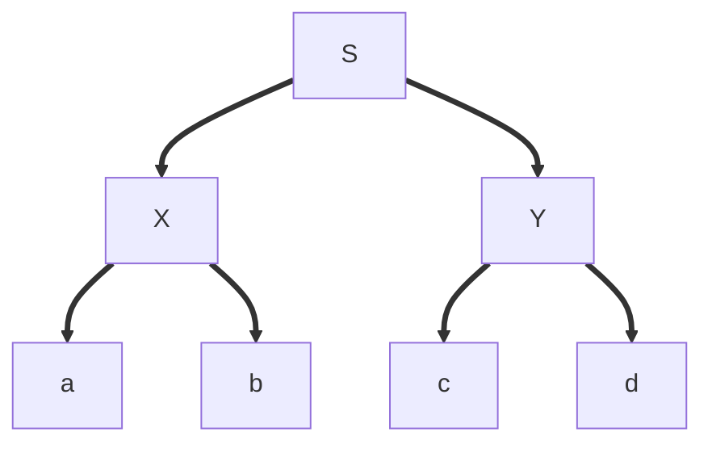

# Bottom-Up Parser

## Grammar 1:

S=>XY  
X=>ab  
Y=>cd

### Top-Down:

Start with S
input: [a,b,c,d]
S link to X and Y
link X to a and b
link Y to c and d

Build from the Left and Top-Down

### Bottom-up:

Put a then b to the stack (shift)
ab can be reduce as an X
1.shift => 2.reduce
Put c to the stack, cX is nothing
Put d to the stack, cd => Y
XY => S

Build from the left Bottom-up

## Grammar 2:

E=>E+E (rule 1)  
E=>E\*E (rule 2)  
E=>id (rule 3)

Input: X+Y*Z
Tokens: id+id*id

### Generate the expression:

E =rule2=> E\*E =rule3=> E\*id =rule1=> E+E\*id =rule3=> id+id\*id

Problem, this is only one way of generating, we could do differently because the grammar is ambiguous.

### Top-Down parser

Impossible to parse with a Top-Down parser.

### Bottom-Up parser

**input: id+id\*id**
Put the id in the stack, id=>E  
Put the + to the stack, E+ is nothing  
Put the id in the stack, id=>E,
We have a shift reduce conflict, possibility to reduce but we can also shift.
Let's shift (correct priority but parser don't know)  
Put the * in the stack,
Put the id in the stack, id=>E
All input consumed, on the stack E+E*E
Reduce E+E*E=>E+E
Reduce E+E=>E
