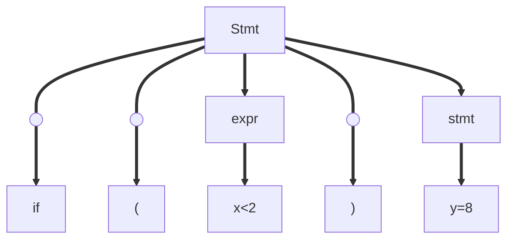
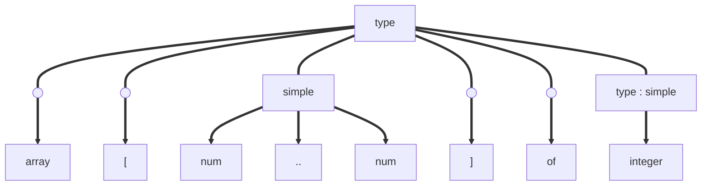

# Top-Down parser

Language is:

## Grammar:

stmt ==> if ( expr ) stmt  
example: if (x>2) y=8;

Parsing tree:



Possibility to watch the tree Top-Down or Bottom-Down.  
The Top-Down method is the simpler method but have some constraint.

Example: Data-typer in Pascal:

### Pascal

int x;  
var x: Integer;  
Pascal's possible **Expressions**:

-   integer
-   char
-   1..20
-   array [2..6] of integer
-   array [char] of integer
-   array [1..10] of array [1..3] of [2..6];

**Grammar**:

-   type --> simple
    -   --> integer
    -   --> char
    -   --> num..num
-   type --> array
    -   --> array[simple] of type
-   type --> ^type (_pointer_)

**Source program**:

```
array[1..10] of integer
```

### Tokenization of the source program

Tokens: [array ; [ ; num ; .. ; num ; ] ; of ; integer ]

Tokenization tree:



LL(1) parser :

-   read tokens from the Left
-   build the tree from the Left
-   1 token by 1 token

Perdictive parser!  
Can always predict what rule apply to each tokens. No need to know the context to apply a certain rule.  
Lookahead/Current token!

Non predictive parser use backtrack and guess.

## The parser

Predictive recursive-descent parser.  
One function (=procedure) for each non-terminal.  
Assume:

```C
scan()
lookahead=scan()
void match(int expected){
    if (lookahead != expected){
        error();
    }
    lookahead=scan();
}
void simple(){
    if (lookahead==integer){
        match(integer);
    }
    else if (lookahead==char){
        match(char);
    }
    else if (lookahead==num){
        match(num);
        match(dotdot);
        match(num);
    }
    else{
        
    }
}
```
