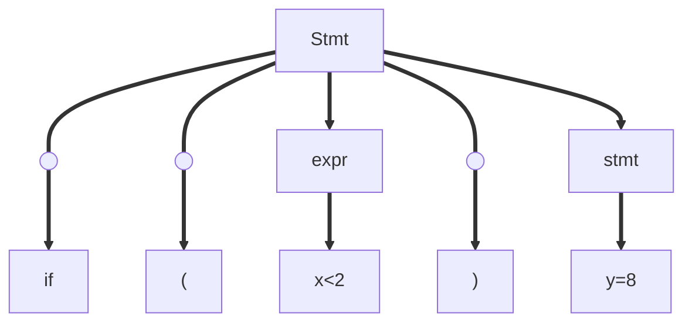
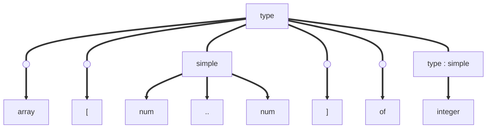
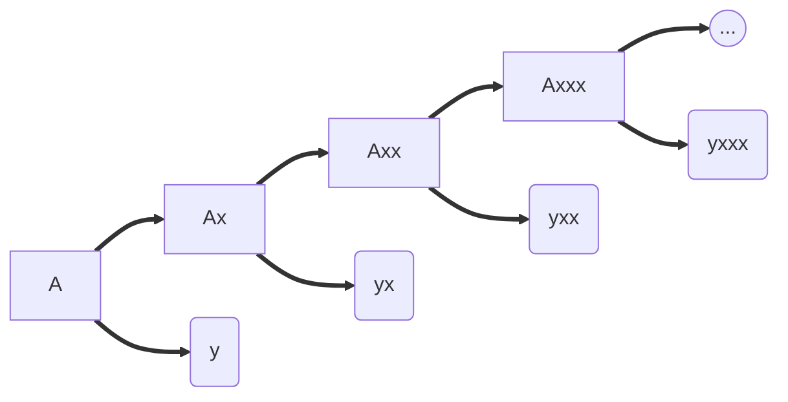
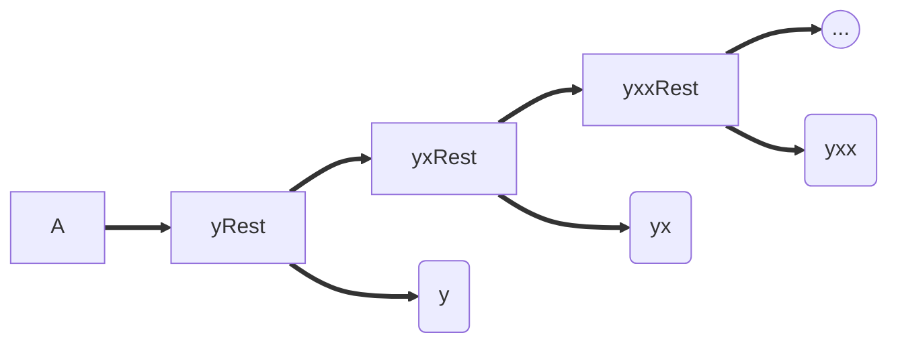

# Top-Down parser

Language is:

## Grammar:

stmt ==> if ( expr ) stmt  
example: if (x>2) y=8;

Parsing tree:



Possibility to watch the tree Top-Down or Bottom-Down.  
The Top-Down method is the simpler method but have some constraint.

Example: Data-typer in Pascal:

### Pascal

int x;  
var x: Integer;  
Pascal's possible **Expressions**:

-   integer
-   char
-   1..20
-   array [2..6] of integer
-   array [char] of integer
-   array [1..10] of array [1..3] of [2..6];

**Grammar**:

-   type --> simple
    -   --> integer
    -   --> char
    -   --> num..num
-   type --> array
    -   --> array[simple] of type
-   type --> ^type (_pointer_)

**Source program**:

```
array[1..10] of integer
```

### Tokenization of the source program

Tokens: [array ; [ ; num ; .. ; num ; ] ; of ; integer ]

Tokenization tree:



LL(1) parser :

-   read tokens from the Left
-   build the tree from the Left
-   1 token by 1 token

Perdictive parser!  
Can always predict what rule apply to each tokens. No need to know the context to apply a certain rule.  
Lookahead/Current token!

Non predictive parser use backtrack and guess.

## The parser

Predictive recursive-descent parser.  
One function (=procedure) for each non-terminal.  
Assume:

```C
scan()
lookahead=scan()
void match(int expected){
    if (lookahead != expected){
        error();
    }
    lookahead=scan();
}
void simple(){
    if (lookahead==integer){
        match(integer);
    }
    else if (lookahead==char){
        match(char);
    }
    else if (lookahead==num){
        match(num);
        match(dotdot);
        match(num);
    }
    else{
        error();
    }
}
void type(){
    if (lookahead==integer || lookahead==char || lookahead==num){
        simple();
    }
    else if (lookahead==array){
        match(array);
        match("[");
        simple();
        match("]");
        match(of);
        type();
    }
    else if (lookahead==^){
        match(^);
        type();
    }
    else {
        error();
    }
}
```

### Left recursion

expr --> number | expr + number
Problem: expr --> expr + number

```C
void expr(){
    if (lookahead==number){
        expr(); // Create infinite loop !!
        match("+");
        match(number);
    }
}
```

NO LEFT RECURSIVE GRAMMARS FOR A TOP DOWN PARSER!

**Transform the grammar**:
A ==> Ax | y
transfrom into:
A ==> y rest
rest ==> x rest | ø





```C
void expr(){
    match(y);
    rest();
}
void rest(){
    if (lookahead==x){
        match(x);
        rest();
    }
    else{
        // everything's ok
    }
}
```

## How to write a top-down parser:

1. Decide the language
2. Write a grammar for the language
3. Remove ambiguity
    1. Remove FIRST() conflicts
    2. Remove left recursion
    3. Write the parser
4. OR: Use a tool like Bison

## The 2.5 program

Language:  
Possibility:

-   2 => 2
-   2+3 => 23+
-   3+4-4-5+5 =>34+4-5-5+

but not:

-   2\*4
-   12+3
-   6-(5+4)
-   6-++
-   6/7

Grammar:

expr=> term|expr+term|expr-term
term=> 0|1|2|3|4|5|6|7|8|9

We also want to print the output, semantic action.
