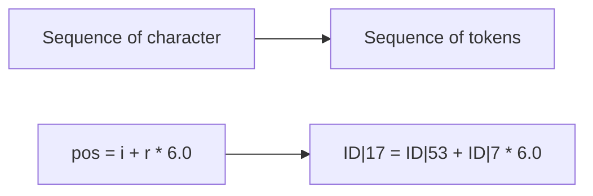
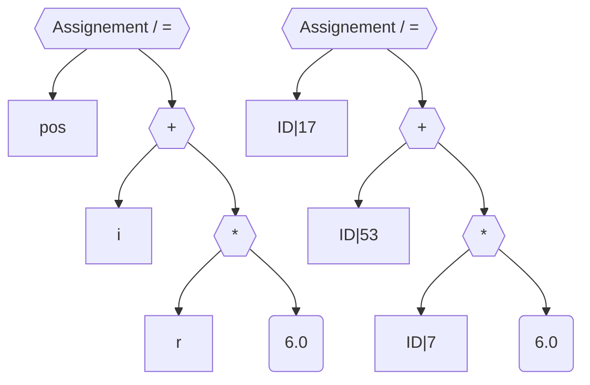
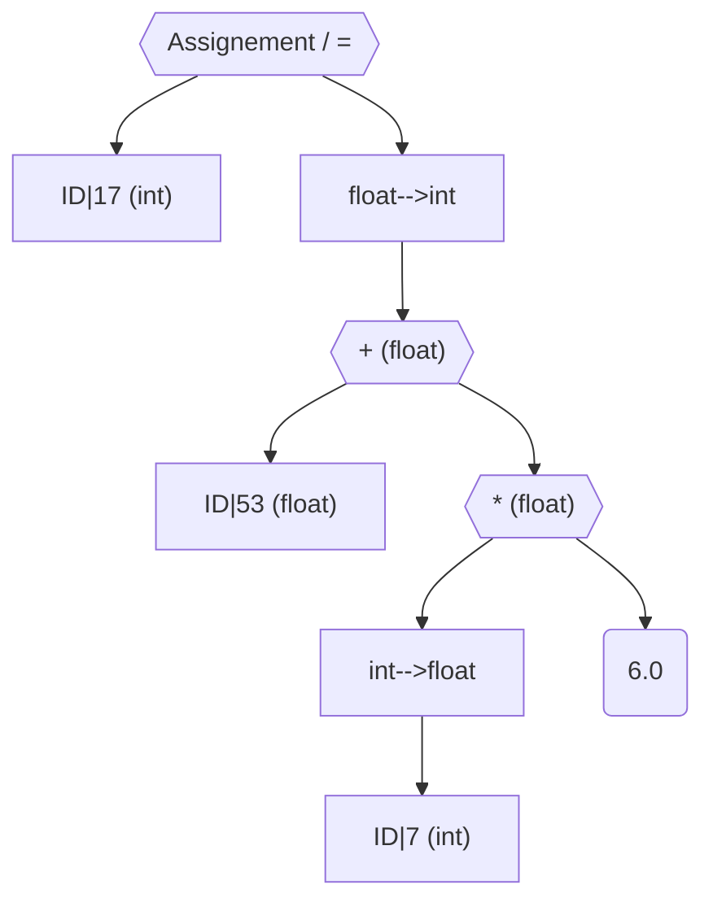
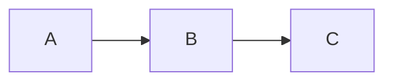

# Compiler and interpreters introduction

Compiler translate a program from one format to another.
Goal:

-   Learn how to build a compiler
-   Learn how to use a compiler

Editor:  
=> Source Code: foo.c  
=> compiler  
=> Object Module: foo.o (executable code, at least part of it)  
=> Linker: add Library, RunTime system  
=> Executable program: foo

**_2 Linking: static and dynamic_**  
**Static**, build your executable program in advance then share the program  
**Dynamic**, link when execute

Static means : _at compile time_  
Dynamic means : _at run time_

Can also have interpreted language which execute with source code with an interpreter.

# Compiler: 7 phases

## Lexical analyser / Scanner : Phase 1

Analysis what sequences of character are what tokens (small meaningful sequence of character, variable, operator...)



## Synthax Analyser / Parser : Phase 2

Build a tree from the tokens we get.

```js
pos = i + r * 6.0;
```



```C
//First example
int x=2
int y=3
x+y

//Second Example
float x=2
float y=3
x+y
```

The 2 operations seems similar but works differently in a bit level, this is even more true with string operation.

2+3+4 = 9
'2'+3+4 = '234'
This is semantic

Here come the datatype checking.

## Semantic Analyser : Phase 3

The first time you see an identifier or a declaration, you put in the symbol table. It gives every variable a datatype.

Example with pos = i + r \* 6.0; :

**Symbol table**
|id |name |datatype |
|:---:|:---:|:---:|
|17 |pos |Int |
|3 |i |float |
|62 |r |int |

With the above table, we see the that r which is an integer is multiply by 6.0 which is a float number.  
It depends of the language obviously, but usually, it will convert r to a float number so that a float number multiplication can be used.
Again with the pos equality, we say that an integer must have a float value, so the value is converted to an integer.

The new tree is:



## Intermediate code generator : Phase 4

tmp1=intToFloat(ID7)  
tmp2=tmp1\*6.0  
tmp3=ID53+tmp2  
tmp4=floatToInt(tmp3)  
id17=tmp4

Above is the intermediate code

## Machine independent code optimizer : Phase 5

Remove unnecessary step:  
For example, id17=floatToInt(tmp3), no need to store tmp4.

Give also smaller and/or faster intermediate code.  
_Can be longer with loop enrolling_

It is a machine **independent** code optimizer because it will be faster on any CPU, same optimization everywhere.

## Code generator : Phase 6

Create code in the target language, can be machine code, assemblor or others.

Precedent code become:  
LOAD R1, ID62  
CONVIF R1,R2  
MOVE TEMP1, R2
MOVE R2, TEMP1
MULT R2, #6.0
MOVE TEMP2, R2
...

## Machine dependent code optimizer : Phase 7

Convert the precedent code into the target program (target language)

## From language code to machine code

