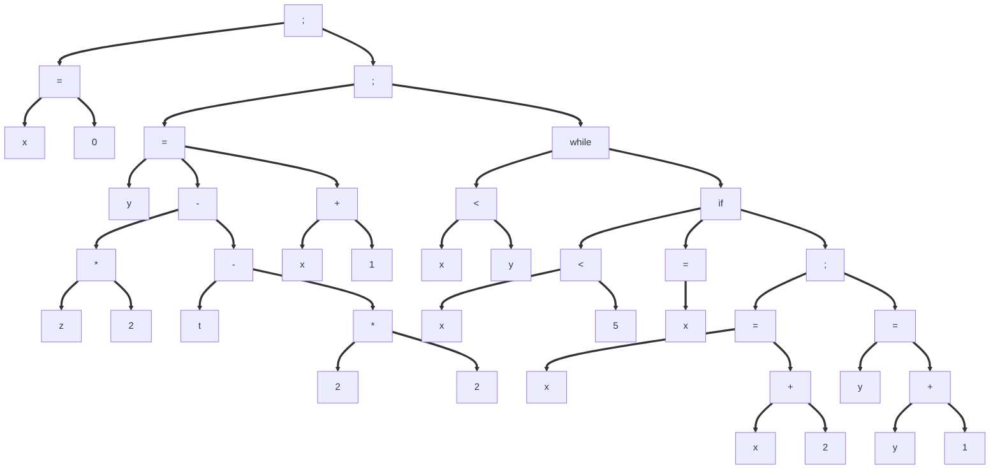

# Task 1

7 phases of the compilers:

1. Scanner : It will analyze the character of the code and transform them into tokens.
   Characters ==> Tokens
2. Parser : It will analyze the tokens and organize them in a syntax tree in function of the grammar.
   Tokens ==> Syntax tree
3. Semantic Analyser : It will analyze the datatype of all the tokens to verify there is no incoherence (float + string). It will add the datatype to the syntax tree
   Syntax tree ==> Syntax tree (with datatype)
4. Intermediate code generator : With the syntax tree, it will create the intermediate code.
   Syntax tree (with datatype) ==> intermediate code
5. Machine-independant code optimizer : It will optimize the intermediate code to make it faster and often smaller (only exception with loop)
   Intermediate code ==> Smaller/Faster intermediate code
6. Code generator : It will create the program in the target language. It can be assembly, C or even machine code.
   Smaller/Faster intermediate code ==> Code in target language
7. Machine-dependant code optimizer : It will make the last optimization only possible in the target language for the code to be the fastest/smallest possible.
   Code in target language ==> Smaller/Faster code in target language.

# Task 2

```C
#include <stdio.h>

int main(void) {
    prontf("Starting...\n");    // 1: undefined reference to `prontf'
    int a = 17zzz;              // 2: invalid suffix on integer constant
    int b = ;                   // 3: expected expression before ';' token
    int c = 0;
    if (c == 0) {
        int d = a / c;          // 4: math exception
        int e, f, g;
        int h                   // 5: expected '=', ',' or ';' before 'e'
        e = 17;                 // 6: variable 'e' set but not used
        f = g;                  // 7: 'g' may be used uninitialized
        printf("d = %d, f = %d\n", d, f);
    }
    return "Done!";             // 8: return makes integer from pointer
}
```

Error 1: The function prontf don't exist, it will be detected by the linker (or semantic analysis).
Error 2: The value is not convertible to tokens, it will be detected by the scanner.
Error 3: The grammar expect something after the = and before the ;, it will be detected by the parser.
Error 4: Division by 0, it will be detected by the machine-independant code optimizer
Error 5: Miss a ; according to the grammar, detected by the parser.
Error 6: Variable not used, it will be detected by the machine-independant code optimizer
Error 7: g initilization useless, it will be detected by the machine-independant code optimizer
Error 8: Problem of datatype, it will be detected by the semantic analyzer.

# Task 3

```C
x = 0;
y = z * 2 - t - 2 * 2;
while (x < y) {
    if (x < 5) {
        x = x + 1;
    }
    else {
        x = x + 2;
        y = y + 1;
    }
}
```


