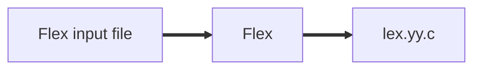

# Lex Flex

## Lex

The scanner analyze the token type and the lexical value.  
Lexeme

## Flex

Flex input file:

```
Declaration
%%
Rules
%%
C code
```



## Regular expressions

Sort of characters:

-   abc <-- Normal characters
-   \* <-- zero or more occurences
-   () <-- Grouping (ex: (ab)\* === ab x times)
-   | <-- OR

Regular expressions can permit to define what a type is:
letter === (a|b|c|d...)
digit === (0|1|2|3|4|5|6|7|8|9)
expression === letter(letter|digit)\*

Regular expresssion can't be recursive

digits === digit digit\*
optional_function === (\. digits)|ø
optional_exponent === (E(-|+|ø) digits)|ø
Unsigned real number === digits optional_function optional_exponent

## More regexps

More characters:

-   \. <-- any character (except \n)
-   \n <-- newline
-   \+ <-- one or more
-   \? <-- zero or one
-   ^ <-- beginning of line
-   $ <-- end of line
-   "^" <-- to mean actual character inside quotes
-   [abc] <-- a|b|c
-   [a-d] <-- a|b|c|d
-   [\n\t ]+ <-- one or more whitespace characters
-   [^ab] <-- anything except a or b
-   [a^b] <-- a|^|b

## The Flex input file "language.l"

```
%{
    #include <stdio.h>
    #include "language.tab.h"
    extern int yylval
%}
delim [[]\t\n]
ws {delim}+
letter [A-Za-z]
digit [0-9]
{ws} {}
```