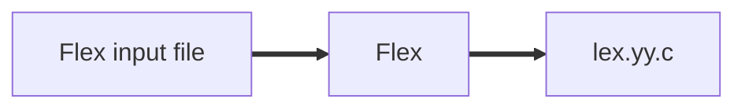
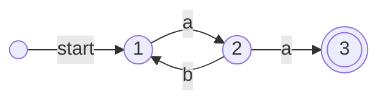
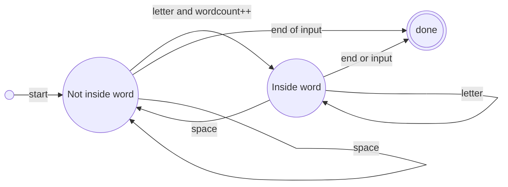

# Lex Flex

## Lex

The scanner analyze the token type and the lexical value.  
Lexeme

## Flex

Flex input file:

```
Declaration
%%
Rules
%%
C code
```



## Regular expressions

Sort of characters:

-   abc <-- Normal characters
-   \* <-- zero or more occurences
-   () <-- Grouping (ex: (ab)\* === ab x times)
-   | <-- OR

Regular expressions can permit to define what a type is:
letter === (a|b|c|d...)
digit === (0|1|2|3|4|5|6|7|8|9)
expression === letter(letter|digit)\*

Regular expresssion can't be recursive

digits === digit digit\*
optional_function === (\. digits)|ø
optional_exponent === (E(-|+|ø) digits)|ø
Unsigned real number === digits optional_function optional_exponent

## More regexps

More characters:

-   \. <-- any character (except \n)
-   \n <-- newline
-   \+ <-- one or more
-   \? <-- zero or one
-   ^ <-- beginning of line
-   $ <-- end of line
-   "^" <-- to mean actual character inside quotes
-   [abc] <-- a|b|c
-   [a-d] <-- a|b|c|d
-   [\n\t ]+ <-- one or more whitespace characters
-   [^ab] <-- anything except a or b
-   [a^b] <-- a|^|b

## The Flex input file "language.l"

```
%{
    #include <stdio.h>
    #include "language.tab.h"
    extern int yylval
%}
delim [[]\t\n]
ws {delim}+
letter [A-Za-z]
digit [0-9]
%%
{ws} {/* ignore whitespace */}
while {return WHILE;}
else {return ELSE;}
Else {return ELSE;}
[Ee][Ll][Ss][Ee] {return ELSE;}
{letter}({letter}{digit})* {return ID;}
{digit}+ {yylval=atoi(yytext); return NUMBER;}
%%

```

## Example of parser and flex file

```C
// parser.y
%{
    #include <stdio.h>
%}

%token WORD NUMBER STOP

%define parser.error verbose

%%

start: WORD list STOP { printf("Input ok!\n"); } ;

list: thing list | %empty;

thing: WORD | NUMBER ;

%%

int main(void) {
    yyparse();
}

int yyerror(char *s) {
    printf("Fail: %s\n", s);
}
```

```C
// scanner.l
%{
    #include "parser.tab.h"
%}

%%

[a-z]+ {return WORD; }
[0-9]+ {return NUMBER; }
\. {return STOP; }
. {/* just ignore everything else */}
\n {/* and newline too! */}

%%

int yywrap(void) {
    return 1; // "Wrap it up, finish"
}
```

```make
// Makefile
listreader: parser.tab.c lex.yy.c parser.tab.h
    gcc -Wall -Wextra -o listreader parser.tab.c lex.yy.c

parser.tab.c parser.tab.h: parser.y
    bison -d parser.y

lex.yy.c: scanner.l
    flex scanner.l
```

```C
// New version scanner-5.l
%{
    #include "parser.tab.h"
%}

%%

[a-z]+ {return WORD; }
[0-9]+ {return NUMBER; }
\. {return STOP; }
. {/* just ignore everything else */}
\n {/* and newline too! */}

%%

int yywrap(void) {
    return 1; // "Wrap it up, finish"
}

int main(void){
    int token_code;
    while ((token_code = yylex()) != 0) {
        printf("Got token %d\n", token_code);
    }
}
```

## State machine

State machines = finite automata



This is a deterministic finite state machine, non deterministic wouldn't have only one choice for every letter.



```C
int wordcount = 0;
int inside_word = 0;
while((c=getchar())!=EOF){
    if (inside_word){
        if (isletter(c))
    }
    else {
        
    }
}
```
