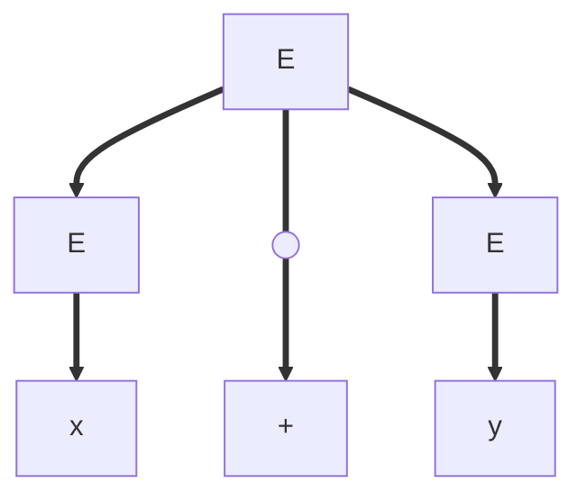
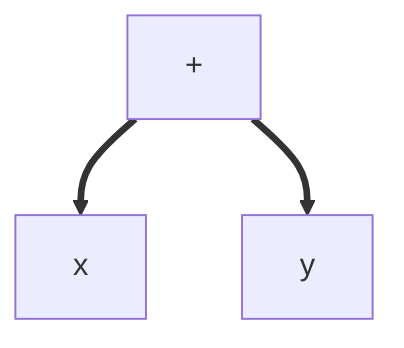
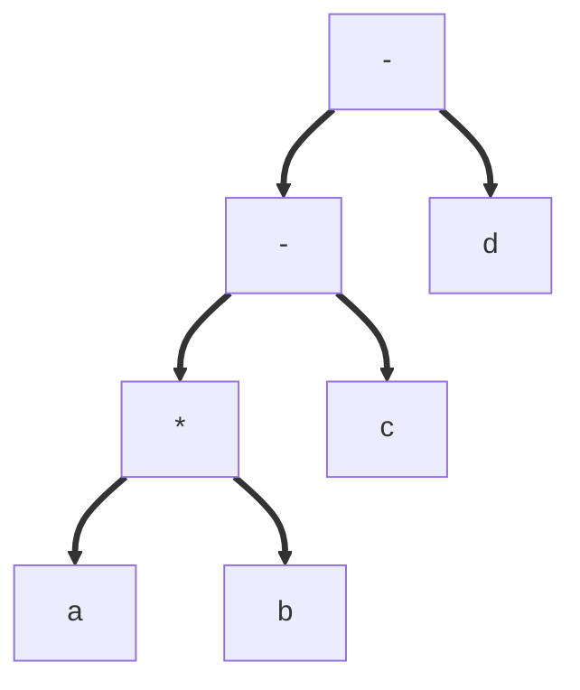
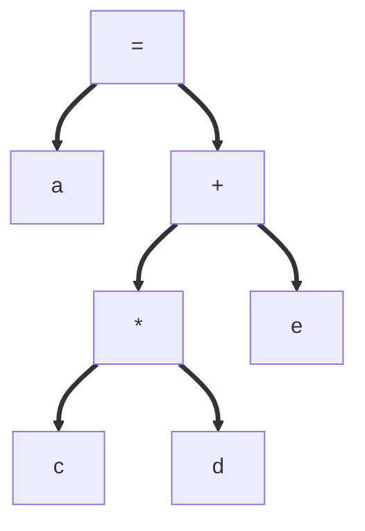
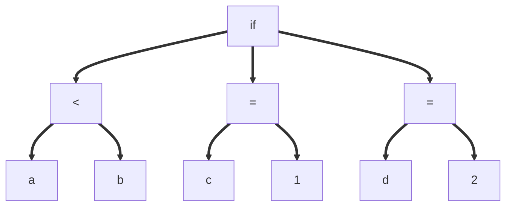
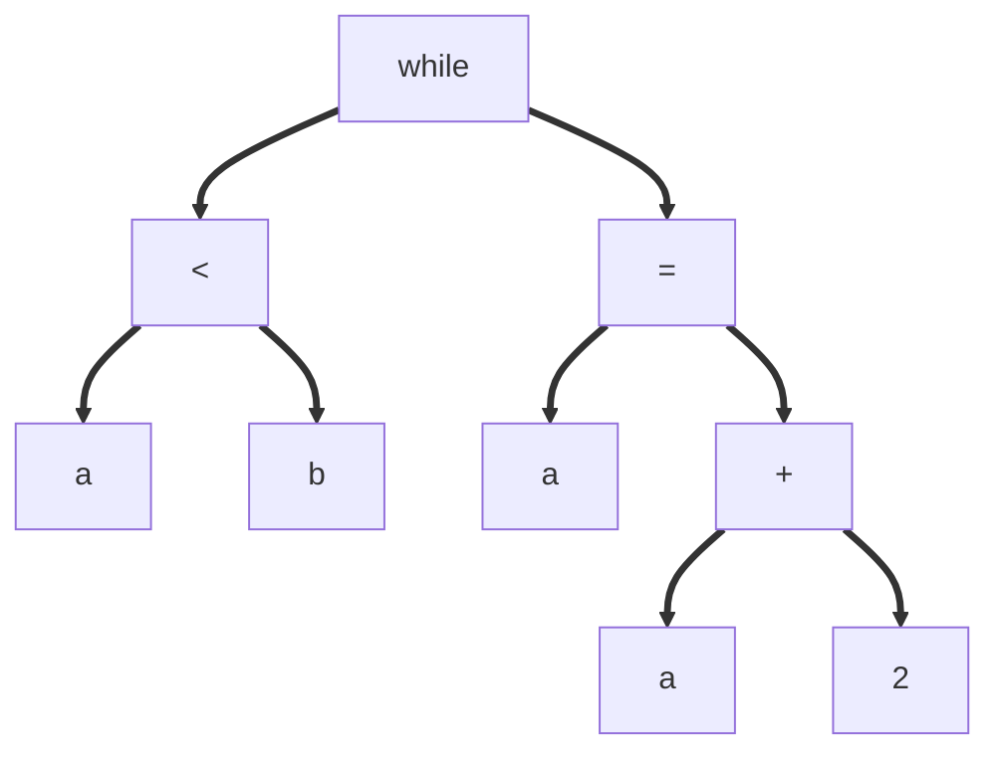
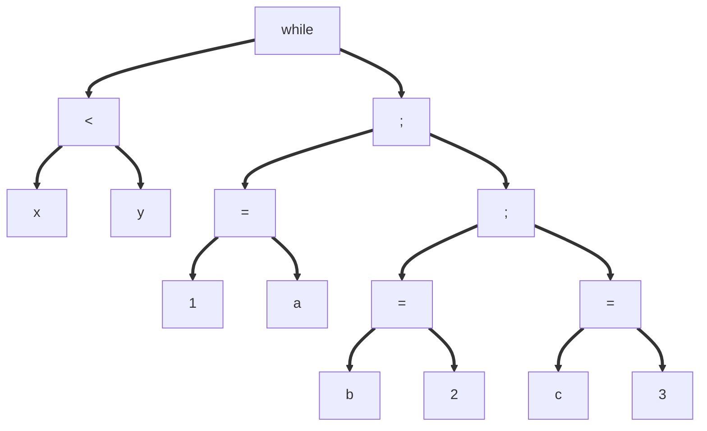
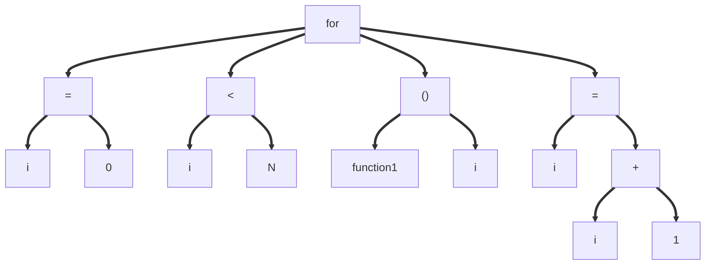
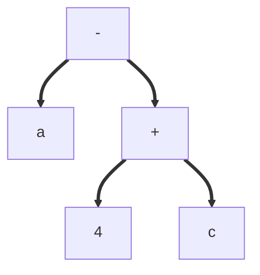
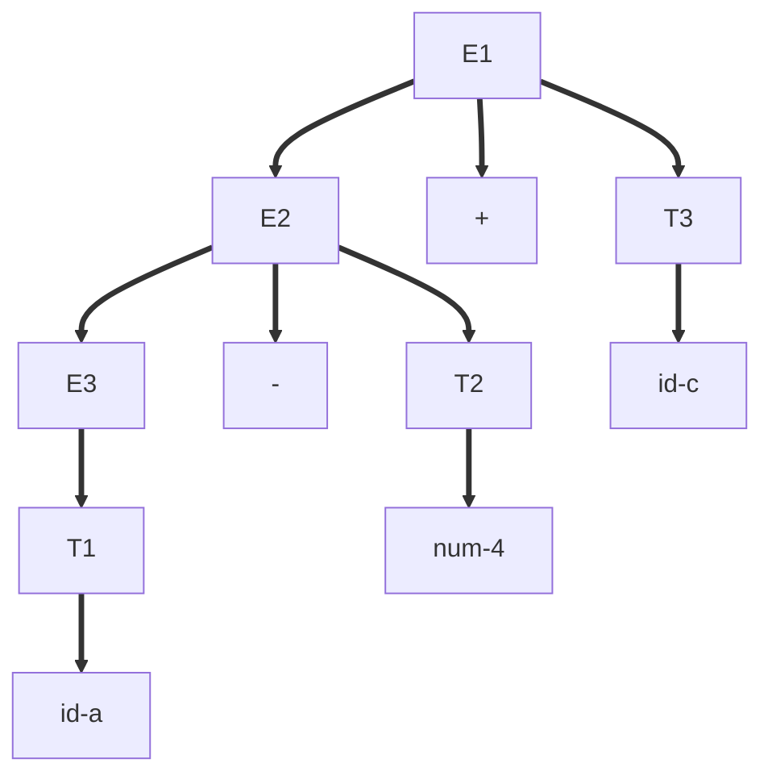

# Synthax trees

How to construct synthax tree
Grammar:
E->id|E+E

Input: x+y
Parse Tree:



Synthax tree:



Input: a\*b-c-d
Synthax tree:



Input: a=c\*d+e



Input:

```C
if (a < b){
    c=1;
}
else{
    d=2;
}
```



If statement synthax tree is composed in three branch:

-   condition
-   resolution of condition
-   else

Input:

```C
while(a<b){
    a=a+2;
}
```



Input:

```C
while(x<y){
    a=1;
    b=2;
    c=3;
}
```



**; is a convention we can call them link or whatever**

Input:

```C
for (i=0;i<N;i++){
    function1(i);
}
```



```C
enum NodeType{PLUS, MINUS, TIMES,...,IF, WHILE, ID, NUM}
struct Node {
    enum NodeType type;
    struct Node *args[3];
    int leaf_value;
};
```

Grammar:

-   E->E+T|E-T|T
-   T->id|num|(E)

Input: a-4+c === id-num+id

Synthax tree:



Parse tree:



mknode(type, arg1, arg2, arg3)
example with input above:

```C
mknode(PLUS, p1, p2, NULL)
mkleaf(ID, idvalue)
mkleaf(NUM, value)
```

Production:
E1=>E2+T
E1=>E2-T
E1=>T

Semantic rule:
E1.nodeptr=mknode(PLUS, E2.nodeptr, T.nodeptr, NULL)
E1.nodeptr=mknode(MINUS, E2.nodeptr, T.nodeptr, NULL)
E1.nodeptr=mknode(T.nodeptr)
