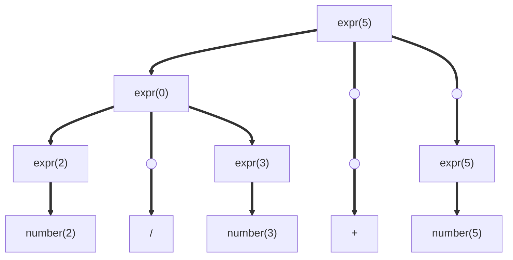

# Yacc/Bison

Yacc/Bison has for goal to create automatically a parser.

### Grammar:

expr=>number|expr+expr|expr/expr

Example input: 2/3+5
Token stream: number(2);/;number(3);+;number(5)  
lexical value under parenthesis

We can give value to each expression as see in the tree.
2/3=0 because 2 and 3 are counted as integer.
In python it would be 0.6667 and transformed to a float.

## Two types of syntax-directed translation

1. Syntax-directed definition
2. Syntax-directed translation scheme

| Production         | Semantic Rule                                 |
| :----------------- | :-------------------------------------------- |
| expr=>number       | expr.value=number.value                       |
|                    | expr.type=integer                             |
| expr1=>expr2/expr3 | expr1.value=expr2.value/expr3.value           |
|                    | expr1.type=float                              |
| expr1=>expr2+expr3 | expr1.value=expr2.value+expr3.value           |
|                    | if expr2.type\=\=float or expr3.type\=\=float |
|                    | expr1.type=float                              |
|                    | else expr1.type=integer                       |

A syntax-directed translation scheme

expr=>number {print(number.value)}
expr=>expr+expr {print("+")}
expr=>expr/expr {print("/")}

Yacc (Yet Another Compiler Compiler), the old one
Bison, the new one
