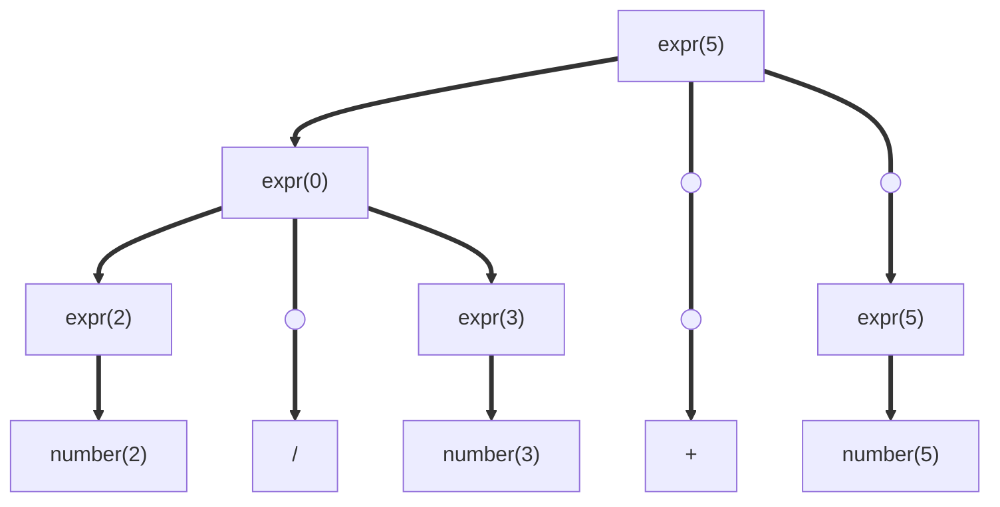
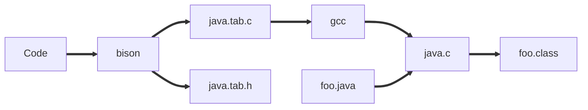

# Yacc/Bison

Yacc/Bison has for goal to create automatically a parser.

### Grammar:

expr=>number|expr+expr|expr/expr

Example input: 2/3+5
Token stream: number(2);/;number(3);+;number(5)  
lexical value under parenthesis



We can give value to each expression as see in the tree.
2/3=0 because 2 and 3 are counted as integer.
In python it would be 0.6667 and transformed to a float.

## Two types of syntax-directed translation

1. Syntax-directed definition
2. Syntax-directed translation scheme

| Production         | Semantic Rule                                 |
| :----------------- | :-------------------------------------------- |
| expr=>number       | expr.value=number.value                       |
|                    | expr.type=integer                             |
| expr1=>expr2/expr3 | expr1.value=expr2.value/expr3.value           |
|                    | expr1.type=float                              |
| expr1=>expr2+expr3 | expr1.value=expr2.value+expr3.value           |
|                    | if expr2.type\=\=float or expr3.type\=\=float |
|                    | expr1.type=float                              |
|                    | else expr1.type=integer                       |

A syntax-directed translation scheme

expr=>number {print(number.value)}
expr=>expr+expr {print("+")}
expr=>expr/expr {print("/")}

Yacc (Yet Another Compiler Compiler), the old one
Bison, the new one from GNU

## Java compiler

java.y ≃ grammar



Declaration
%%
Productions
%%
C code

into

```C
%{//C declaration
    #include <stdio.h>
    #include "global.h"
    extern int tokeneval;
%}
//Bison declaration
%token ID NUM IF ELSE DONE

%%
start: list DONE
    ;
list: expr ';' list
    | %empty
    ;
expr: expr '+' term {printf('+');}
    | term
    ;

%%

```

<ins>A calculator</ins>
2+3\*4+5

<ins>Bison input file</ins>

```C
%{
    #include <stdio.h>
    #include <ctype.h>
%}
%token DIGIT
%%
line: expr '\n' {printf("%d\n", $1);} //$$ is line $1 is expr $2 is '\n' etc
    ;
expr: expr '+' term {$$=$1+$3;}
    | term {$$=$1;} //$$=$1 is default so no need to write it
    ;
term: term '*' factor {$$=$1*$3;}
    | factor
    ;
factor: DIGIT
    | '(' expr ')' {$$=$2;}
    ;
%%

int yylex(){
    int c=getchar();
    if (isdigit(c)){
        yylval=c-'0';
        return DIGIT;
    }
}

int main(void){
    yyparse();
}
yyerror(char*5){...}

%%

expr: expr '+' term {$$=$1+$3;}
    | expr '-' term {$$=$1-$3;}
    | expr '*' term {$$=$1*$3;}
    | expr '/' term {$$=$1/$3;}
    | '(' expr ')' {$$=$2;}

//Lower=higher priority
%left '+' '-'
%left '*' '/'
%right '='
%nonassoc '>'
```
