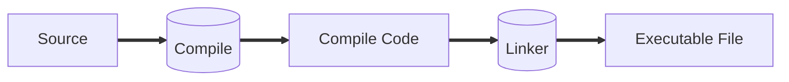

# Run-Time Environment

Source code run through the compiler and we get a compile code

```mermaid
flowchart LR
    S[Source]==>C[(Compile)]==>CC[Compile Code]==>L[(Linker)]==>EF[Executable File]
```