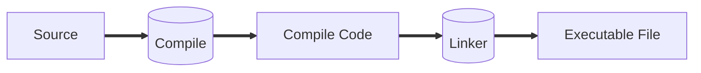

# Run-Time Environment



We will see the run-time of the executable file.

Some terms:

-   Function = Procedure = Method
-   Function definition
-   Function name
-   Function body
-   Function call
-   Function parameters
-   Function activation
-   Actual parameters

```C
int /*return type*/ f /*function name*/ (int n) /*formal parameters*/
{// Function body
    int r;
    if (n==1){
        return 1;
    }
    else{
        r=n*f(n-1);
        return r;
    }
}

int main(void){
    int n=f(4);// Function activation
    return 0;
}
```

Activation record when the function is activated.
The function f in the above code is recursive so in the **Call stack** it's called multiples times.
Function called in order:
- main
- f(4)
- f(3)
- f(2)
- f(1)

As recursive function, we go 
