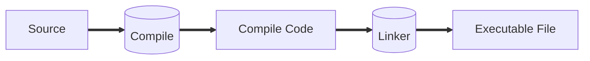

# Run-Time Environment



We will see the run-time of the executable file.

Some terms:

-   Function = Procedure = Method
-   Function definition
-   Function name
-   Function body
-   Function call

```C
int /*return type*/ f /*function name*/ (int n) /*formal parameters*/
{// Function body
    int r;
    if (n==1){
        return 1;
    }
    else{
        r=n*f(n-1);
        return r;
    }
}

void main(){
    int n=f(9);// Function call
    return 0;
}

```
