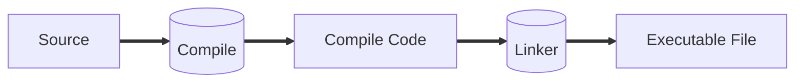

# Run-Time Environment



We will see the run-time of the executable file.

Some terms:

-   Function = Procedure = Method
-   Function definition
-   Function name
-   Function body
-   Function call

```C
int f(int n) //function name
{
    int r;
    if (f==1){
        return 1;
    }
    else{
        r=n*f(n-1);
        return r;
    }
}
```